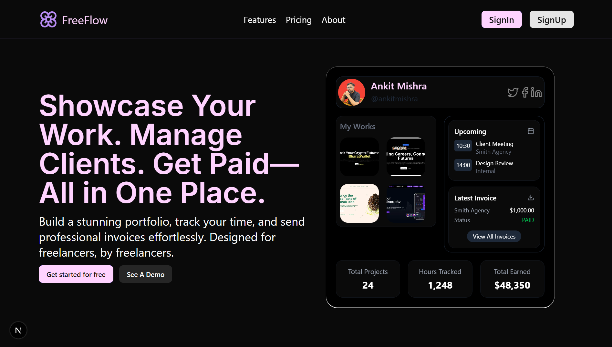

# 🌊 FreeFlow

**FreeFlow** is an all-in-one platform built for freelancers to **showcase their work, manage clients, track time, and get paid**—all from one clean, beautiful dashboard.

Built with creators in mind, FreeFlow helps simplify the chaos of client work with thoughtful UI, smart tools, and smooth workflows.

---

## ✨ Features

- 🎨 **Portfolio Builder** – Display your best work effortlessly
- 🧠 **Client Management** – Track meetings and projects
- ⏱️ **Time Tracking** – Stay on top of billable hours
- 💸 **Invoices** – Send and track payments in one place
- 📊 **Dashboard** – Insights into your work, earnings, and hours

---

## 🛠️ Tech Stack

| Layer       | Tech                                                          |
| ----------- | ------------------------------------------------------------- |
| Framework   | [Next.js 15](https://nextjs.org/)                             |
| Styling     | [Tailwind CSS 4](https://tailwindcss.com/) + `tw-animate-css` |
| Animations  | [Motion One](https://motion.dev/)                             |
| Icons       | [Lucide React](https://lucide.dev/)                           |
| Utilities   | `clsx`, `tailwind-merge`, `class-variance-authority`          |
| Type System | TypeScript                                                    |
| Linting     | ESLint (with Next.js config)                                  |

---

## 🚀 Getting Started

1. **Clone the repo**

   ```bash
   git clone https://github.com/ankitmrmishra/FreeFlow.git
   cd freeflow
   ```

2. **Install dependencies**

   ```bash
   npm install
   ```

3. **Start the development server**

   ```bash
   npm run dev
   ```

4. Open [`http://localhost:3000`](http://localhost:3000) in your browser.

---

## 📂 Scripts

| Script          | Description             |
| --------------- | ----------------------- |
| `npm run dev`   | Start dev server        |
| `npm run build` | Build for production    |
| `npm run start` | Start production server |
| `npm run lint`  | Run ESLint checks       |

---

## 📸 Sneak Peek



---

## 🤝 Contributing

Coming soon: We’ll open up issues and contribution guidelines once we hit v1.0. Feel free to star or fork in the meantime!

---

## 📃 License

MIT © Ankit Mishra

---

## 🙌 Acknowledgements

Made with love for freelancers and creators who deserve better tools.
